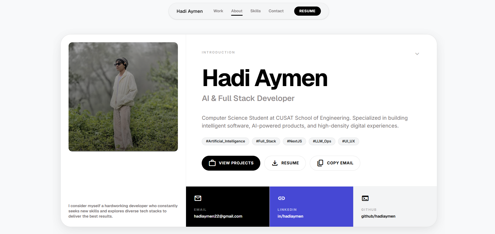
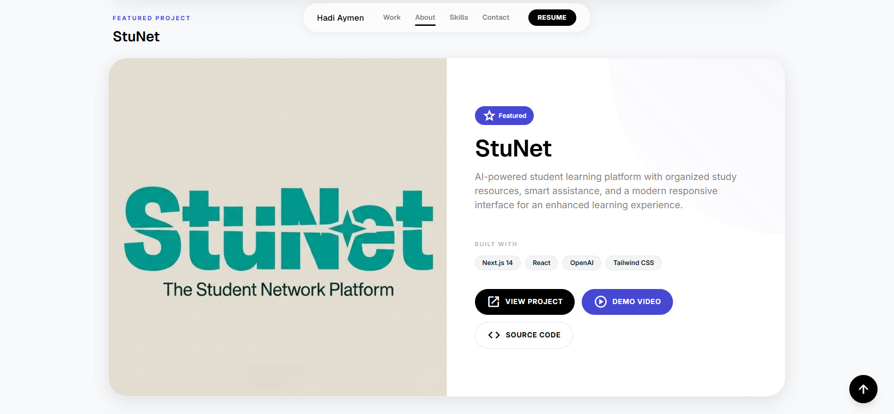
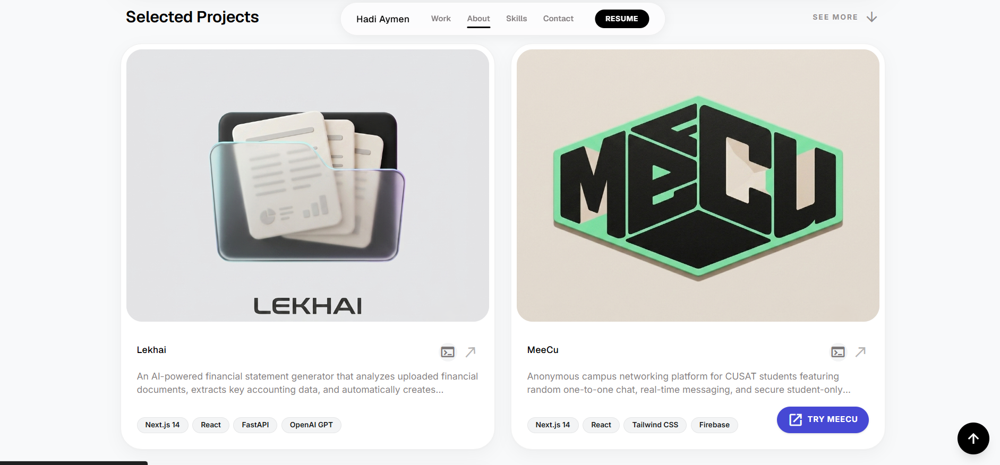
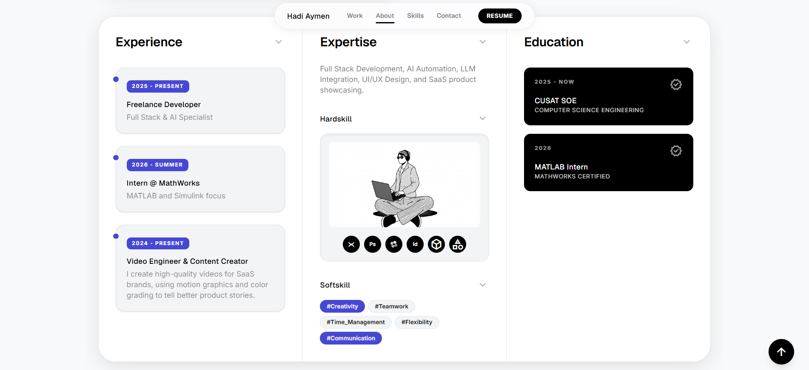

# Hadi Aymen – Portfolio

My personal portfolio built to showcase my work, projects, and journey as a Computer Science student focused on AI and Full Stack Development.

The website highlights my featured projects, technical skills, experience, education, and provides an easy way to connect with me.

## Live Website

🔗 https://hadiaymen.vercel.app

## Tech Stack

- Next.js
- React
- TypeScript
- Tailwind CSS
- Framer Motion

## Featured Projects

- **StuNet** – AI-powered student learning platform
- **Lekhai** – AI financial statement generator
- **MeeCu** – Anonymous campus networking platform

``
## Contact

- Email: hadiaymen22@gmail.com
- LinkedIn: https://linkedin.com/in/hadiaymen
- GitHub: https://github.com/hadiaymen

---

Thanks for stopping by! If you have any feedback or collaboration ideas, feel free to reach out.

## Screenshots

